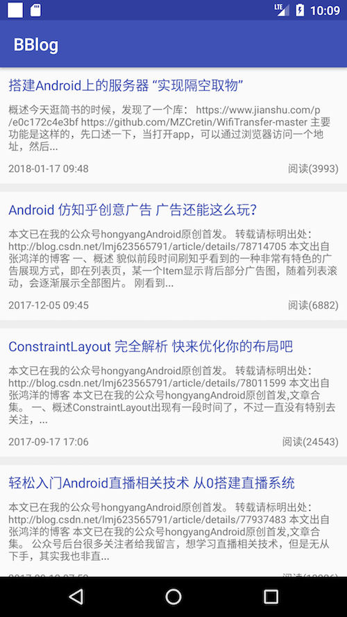
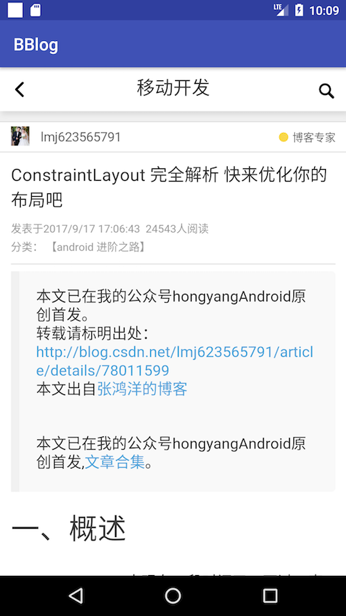

# BBlog
BBlog - 一款技术栈blog 爬虫安卓app，为了收藏和查看方便而整理

### 二、基础架构
基础架构整理，也作为平时项目开发的快速使用

模块分为：主页、、、、

代码结构分为：

app:主app

b.base_lib：基础库

b.base_module：基础模块（基类界面、路由管理、网络请求封装、数据库处理封装等）

b.home_module：主页模块

#### 一、引用库：

1.ButterKnife：（butterknife）https://github.com/JakeWharton/butterknife

2.RxJava1.0：（rxjava1.0）https://github.com/ReactiveX/RxJava/tree/1.x

3.cachewebview：（webview的缓存）https://github.com/yale8848/CacheWebView

4.rxcache：（结合rxjava的缓存处理）https://github.com/z-chu/RxCache

5.tkrefreshlayout：（下拉刷新控件）https://github.com/lcodecorex/TwinklingRefreshLayout

6.Arouter：（实现模块化开发） https://github.com/alibaba/ARouter 

7、stream：（Lightweight-Stream，android兼容实现Java8 Stream 功能）https://github.com/aNNiMON/Lightweight-Stream-API

<!-- 7.Dagger2：（注解）https://github.com/google/dagger -->
#### demo截图：

    

#### app下载地址：
https://www.pgyer.com/bblog

#### 二维码：
 